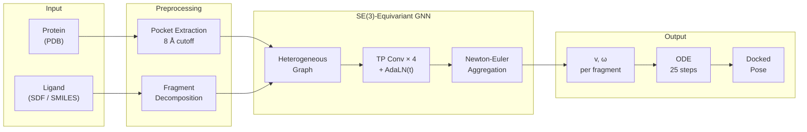

# FlowFrag

**Fragment-based Flow Matching for Protein-Ligand Docking**

FlowFrag predicts protein-ligand docking poses by decomposing ligands into rigid fragments and learning SE(3) velocity fields via flow matching. An ODE integrator assembles the final pose from per-fragment translation and rotation predictions.

## Highlights

- **Fragment-level docking** — ligands are split at rotatable bonds into rigid fragments. The model predicts per-fragment translation velocity **v** and angular velocity **&omega;**, avoiding atom-level force aggregation.
- **SE(3)-equivariant GNN** — tensor product message passing over a heterogeneous protein-ligand graph with irreps up to l=2, accelerated by [cuEquivariance](https://docs.nvidia.com/cuda/cuequivariance/) CUDA kernels.
- **Flow matching on SE(3)** — linear interpolation for translation, SLERP for rotation. Single-step training objective with ODE-based multi-step inference.
- **87% success rate** on PoseBusters v2 (&lt;2&Aring; RMSD, N=40 samples, MMFF refinement).

## Results

Pocket-conditioned re-docking with N=40 samples and MMFF refinement:

| Benchmark | Complexes | Selection | Median RMSD | &lt;1&Aring; | &lt;2&Aring; |
|---|---|---|---|---|---|
| PoseBusters v2 | 308 | Oracle | 0.92 &Aring; | 57.5% | **96.1%** |
| PoseBusters v2 | 308 | Cluster | 1.14 &Aring; | 39.9% | 89.0% |
| PoseBusters v2 | 308 | Rank | 1.14 &Aring; | 37.7% | 87.0% |
| Astex Diverse | 84 | Oracle | 1.06 &Aring; | 46.4% | **85.7%** |
| Astex Diverse | 84 | Cluster | 1.33 &Aring; | 29.8% | 72.6% |
| Astex Diverse | 84 | Rank | 1.29 &Aring; | 35.7% | 73.8% |

> **Oracle** = best of N by ground-truth RMSD (upper bound).
> **Cluster** = centroid of largest 2&Aring;-RMSD cluster.
> **Rank** = top-1 by Vina energy &times; physicochemical validity score.

See [docs/benchmark.md](docs/benchmark.md) for detailed results and N-scaling analysis.

## Method



### Flow Matching on SE(3)

Each ligand fragment carries a rigid-body state *(T, R)* — translation and rotation.

| | Translation | Rotation |
|---|---|---|
| **Prior** (t=0) | N(pocket center, &sigma;&sup2;I) | Uniform on SO(3) |
| **Target** (t=1) | Crystal pose | Crystal pose |
| **Interpolation** | Linear | SLERP |
| **Velocity** | v = dT/dt | &omega; via axis-angle |

The model learns the conditional velocity field. At inference, an ODE integrates from prior to pose:

```
T(t+dt) = T(t) + dt * v
R(t+dt) = exp(dt * [ω]×) * R(t)
```

### Architecture

The model operates on a unified heterogeneous graph with 5 node types (ligand atoms, dummy atoms, fragment centers, protein atoms, C&alpha; nodes) and up to 10 edge types covering intra-ligand, intra-protein, and cross-modal connectivity.

SE(3)-equivariant message passing uses cuEquivariance tensor products with spherical harmonics up to l=2. Time conditioning is applied via adaptive layer normalization (AdaLN). Per-atom forces are aggregated to fragment-level velocities through Newton-Euler mechanics.

See [docs/architecture.md](docs/architecture.md) for the full architecture diagram and design details.

## Installation

### Requirements

- Python &ge; 3.12
- CUDA-capable GPU
- PyTorch &ge; 2.10

### Setup

```bash
git clone https://github.com/eightmm/flowfrag.git
cd flowfrag

# Install uv if not already installed
curl -LsSf https://astral.sh/uv/install.sh | sh

# Install all dependencies
uv sync
```

## Usage

### Data Preparation

Prepare raw complexes with pocket PDB and ligand SDF per complex:

```
raw_data/
└── <pdb_id>/
    ├── <pdb_id>_pocket.pdb
    └── <pdb_id>_ligand.sdf
```

Build the processed dataset:

```bash
uv run python scripts/build_fragment_flow_dataset.py \
    --raw_dir /path/to/raw_data \
    --out_dir data/processed \
    --workers 8
```

### Training

```bash
uv run python scripts/train.py --config configs/train.yaml
```

### Docking

Dock a ligand into a protein pocket:

```bash
# From SDF
uv run python scripts/dock.py \
    --protein pocket.pdb \
    --ligand ligand.sdf \
    --checkpoint outputs/checkpoints/best.pt \
    --config configs/train.yaml \
    --num_samples 40

# From SMILES
uv run python scripts/dock.py \
    --protein pocket.pdb \
    --ligand "CCO" \
    --checkpoint outputs/checkpoints/best.pt \
    --config configs/train.yaml
```

### Benchmark Evaluation

```bash
# PoseBusters v2
uv run python scripts/eval_benchmark.py \
    --data_dir /path/to/posebusters \
    --checkpoint outputs/checkpoints/best.pt \
    --config configs/train.yaml \
    --subset v2 --num_samples 40

# Astex Diverse
uv run python scripts/eval_benchmark.py \
    --data_dir /path/to/astex \
    --checkpoint outputs/checkpoints/best.pt \
    --config configs/train.yaml \
    --num_samples 40
```

## Project Structure

```
flowfrag/
├── src/
│   ├── models/          # SE(3)-equivariant GNN and layers
│   ├── data/            # Dataset and data loading
│   ├── geometry/        # SE(3) operations, flow matching
│   ├── preprocess/      # Raw data → processed tensors
│   ├── training/        # Training loop, losses
│   ├── inference/       # ODE sampler, metrics
│   └── scoring/         # Vina scoring, pose ranking
├── scripts/             # Training, evaluation, docking
├── configs/             # YAML configuration files
├── tests/               # Unit tests
└── docs/                # Documentation
```

## Documentation

| Document | Description |
|---|---|
| [Architecture](docs/architecture.md) | Model architecture, graph structure, and design choices |
| [Benchmark](docs/benchmark.md) | Evaluation results, N-scaling, and methodology |
| [Dataset](docs/dataset.md) | Data format, preprocessing pipeline, and graph topology |
| [Scoring](docs/scoring.md) | Vina energy and physicochemical validity scoring |

## Citation

```bibtex
@software{flowfrag2026,
    title  = {FlowFrag: Fragment-based Flow Matching for Protein-Ligand Docking},
    author = {Jaemin Sim},
    year   = {2026},
    url    = {https://github.com/eightmm/flowfrag}
}
```

## License

This project is released under the [MIT License](LICENSE).

## Acknowledgments

- [cuEquivariance](https://docs.nvidia.com/cuda/cuequivariance/) — SE(3)-equivariant tensor product CUDA kernels
- [SigmaDock](https://arxiv.org/abs/2511.04854) — fragment-based docking framework and combined scoring formula
- [PoseBusters](https://doi.org/10.1039/D3SC04185A) — benchmark dataset and validity checks
