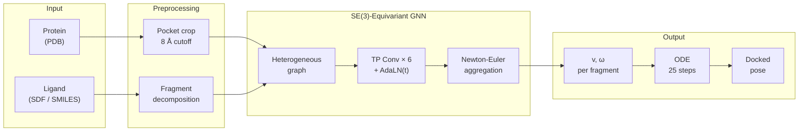
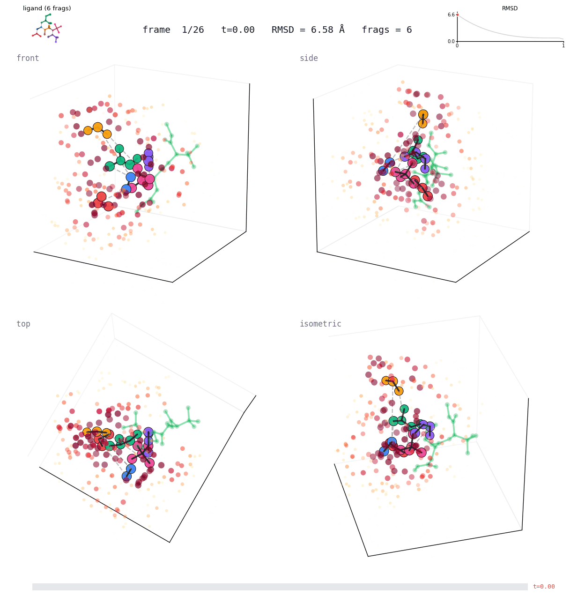

# FlowFrag

**Fragment-based Flow Matching for Protein-Ligand Docking**

FlowFrag predicts protein-ligand docking poses by decomposing ligands into rigid
fragments and learning SE(3) velocity fields via flow matching. A single
SE(3)-equivariant GNN produces per-atom forces that are aggregated via
Newton-Euler rigid-body mechanics into per-fragment translation **v** and
angular **ω** velocities. An ODE integrator then transports a random
prior pose to the docked pose.

## Highlights

- **Fragment-level rigid-body docking** — ligands are split at rotatable bonds
  into rigid fragments; per-fragment (v, ω) is predicted, so rotational and
  translational degrees of freedom are handled natively instead of through
  atom-level displacement.
- **SE(3)-equivariant GNN** — tensor product message passing over a
  heterogeneous protein-ligand graph with irreps up to l=2, accelerated by
  [cuEquivariance](https://docs.nvidia.com/cuda/cuequivariance/) CUDA kernels.
- **Flow matching on SE(3)** — linear interpolation for translation, SLERP for
  rotation, logit-normal time sampling. Single-step training objective
  (v, ω regression); ODE-based multi-step inference.
- **Confidence head for pose selection** — attention-pool ranker
  (`weights/confidence_v1.pt`) trained on per-pose features (pose RMSD
  regression). Closes ~9 pp of the gap between Vina and the sampler oracle
  ceiling on PoseBusters v2.
- **End-to-end SMILES-only inference** — `scripts/dock.py` re-embeds 3D
  conformer with ETKDGv3+MMFF, samples N=40 ODE trajectories at σ=3 Å
  prior, ranks via confidence head, optional MMFF/Vina refinement and
  trajectory GIF rendering.

## Results

All numbers below are from a single deployed checkpoint (`weights/best.pt`)
with 40 ODE samples per complex, 25 ODE steps, prior σ = 3.0 Å, pocket
cutoff 8 Å. Three pose-selection strategies are shown: **Oracle** = best of
40 by ground-truth RMSD (sampler ceiling), **Confidence** = ranked by
trained confidence head (`weights/confidence_v1.pt`), **Vina** = scored by
Autodock-Vina free energy.

### Headline: PoseBusters v2 + Astex Diverse + CASF-2016 (re-docking)

| Benchmark | n | Selection | < 1 Å | **< 2 Å** | < 5 Å | Median RMSD |
|---|---:|---|---:|---:|---:|---:|
| **PoseBusters v2** | 308 | Oracle (sampler ceiling) | 55.8 % | 84.4 % | 97.1 % | 0.88 Å |
| **PoseBusters v2** | 308 | **Confidence (deployed)** | 39.6 % | **70.8 %** | 91.9 % | 1.23 Å |
| **PoseBusters v2** | 308 | Vina | 36.7 % | 61.7 % | 88.3 % | 1.42 Å |
| **Astex Diverse** | 85 | Oracle | 76.5 % | 97.6 % | 100.0 % | 0.61 Å |
| **Astex Diverse** | 85 | **Confidence (deployed)** | 62.4 % | **87.1 %** | 94.1 % | 0.85 Å |
| **Astex Diverse** | 85 | Vina | 51.8 % | 78.8 % | 97.6 % | 0.99 Å |
| **CASF-2016 core** | 284 | Oracle (10-prior top-1) | — | 89.4 % | 98.9 % | 1.07 Å |
| **CASF-2016 core** | 284 | Single prior, 25 step | — | 44.4 % | 90.5 % | 2.15 Å |

The **Confidence** row is the production setting (`scripts/dock.py
--confidence_ckpt weights/confidence_v1.pt`).

### Selector gap analysis

The remaining gap (oracle − confidence) shows where confidence-based
ranking can still improve. Vina is included as a no-learning baseline.

| Benchmark | Oracle ↔ Confidence | Confidence ↔ Vina |
|---|---:|---:|
| Astex (n=85) | 10.5 pp | +8.3 pp |
| PoseBusters v2 (n=308) | **13.6 pp** | +9.1 pp |

Confidence beats Vina by 8–9 pp on both, but ~14 pp of headroom remains
on PoseBusters before reaching the oracle ceiling.

### Failure mode (PoseBusters v2)

Failure rate scales linearly with ligand size and fragment count.
Phosphate-containing cofactors (NTP/FAD/CoA-like) account for **56 % of
HARD failures** (oracle ≥ 5 Å) despite being 25 % of overall samples.

| Bucket | n | Sampler fail (oracle ≥ 2 Å) | Selector fail (Confidence ≥ 2 Å) |
|---|---:|---:|---:|
| n_atom 1–25 | 168 | 4 % | 23 % |
| n_atom 26–35 | 99 | 21 % | 31 % |
| n_atom 36–50 | 34 | **44 %** | **65 %** |
| n_atom 51+ | 7 | **71 %** | 71 % |
| n_frag 1–3 | 105 | 5 % | 22 % |
| n_frag 4–8 | 180 | 16 % | 30 % |
| n_frag 9+ | 23 | **61 %** | **83 %** |

→ Two fixes for the next training round (planned for PLINDER 130k retrain):
relax `max_atoms` 80 → 120 and `max_frags` 20 → 30 to expose
cofactor-class ligands during training, plus apo/predicted receptor
augmentation (already built — 13 k alt receptors preprocessed at
`data/plinder_processed/_alt_proteins/`).

### Integration-step sweep (CASF, single prior)

The learned velocity field is ODE-smooth — 5 steps already capture most
of the accuracy:

| ODE steps | Median RMSD | < 2 Å | < 5 Å |
|---|---|---|---|
| 5  | 2.22 Å | 43.0 % | 91.6 % |
| 10 | 2.17 Å | 43.7 % | 90.9 % |
| 20 | 2.16 Å | 44.4 % | 90.9 % |
| 25 | 2.15 Å | 44.4 % | 90.5 % |

### Trajectory gallery

GIFs of 3 successful (oracle ≤ 0.25 Å) and 3 failure (oracle ≥ 7.5 Å)
PoseBusters cases are rendered by `scripts/viz_traj.py`. See
[outputs/viz_traj_pb_gif/](outputs/viz_traj_pb_gif/) and
[outputs/viz_pb/pb_failure_analysis.png](outputs/viz_pb/pb_failure_analysis.png)
for the failure-rate heat map.

## Method



### Flow matching on SE(3)

Each ligand fragment carries a rigid-body state (T, R) — translation and
rotation.

| | Translation | Rotation |
|---|---|---|
| **Prior** (t=0) | N(pocket center, σ²I), σ = 3.0 Å | Uniform on SO(3) |
| **Target** (t=1) | Crystal pose | Crystal pose |
| **Interpolation** | Linear | SLERP |
| **Velocity target** | v = T₁ − T₀ | ω = axis-angle(q₁ · q₀⁻¹), world frame |

The model learns the conditional velocity field. At inference, the ODE
integrates from prior to pose:

```
T(t+dt) = T(t) + dt · v
R(t+dt) = exp(dt · [ω]×) · R(t)           (left-multiply, world frame)
```

### Architecture

Heterogeneous graph with 4 node types (`ligand_atom`, `ligand_fragment`,
`protein_atom`, `protein_res`) and 10 edge types covering intra-ligand,
intra-protein, and cross-modal connectivity. Per-edge gated tensor product
convolution with dual radial scaling and per-edge-type σ decay. Time
conditioning via Equivariant AdaLN. Per-atom forces at l=1 are aggregated
into fragment (v, ω) via eigendecomposed inertia tensor with pseudo-inverse
(projecting into the observable rotation subspace so rank-deficient 2-atom
fragments contribute only their observable axes).

See [docs/architecture.md](docs/architecture.md) for layer-level details.

## Installation

### Requirements

- Python ≥ 3.12
- NVIDIA GPU with CUDA 13 (tested on B200 / sm_100)
- PyTorch ≥ 2.10 (ships native Muon optimizer)

### Setup

```bash
git clone https://github.com/eightmm/FlowFrag.git
cd FlowFrag
# Install uv if not already installed
curl -LsSf https://astral.sh/uv/install.sh | sh
uv sync --dev
```

The published inference checkpoint ships in the repo at `weights/best.pt`
(~76 MB; model + EMA weights only — no optimizer state).
Load it via any `--checkpoint weights/best.pt` flag.

## Data

### Raw layout

Built from PDBbind 2020 refined set:

```
raw_data/<year-range>/<pdb_id>/
├── <pdb_id>_protein.pdb    # full protein (preferred)
├── <pdb_id>_pocket.pdb     # used as fallback if protein missing
└── <pdb_id>_ligand.sdf     # crystal ligand (mol2 fallback accepted)
```

### Preprocess

```bash
uv run python scripts/build_fragment_flow_dataset.py \
    --raw_dir /path/to/pdbbind2020 \
    --out_dir data/processed \
    --workers 8
```

Produces per complex `data/processed/<pdb_id>/{protein.pt, ligand.pt, meta.pt}`:
the full protein is stored once, and the pocket is cropped at runtime in the
dataset's `__getitem__`. See [docs/dataset.md](docs/dataset.md) for tensor
schemas.

### Split (`data/splits/pdbbind2020.json`)

The split is deterministic and shipped in-repo:

| Split | # Complexes | Source |
|---|---|---|
| **train** | 16,463 | PDBbind 2020 refined set, minus CASF-2016 core, minus size-filtered outliers |
| **val** | 284 | CASF-2016 core set (standard re-docking benchmark) |

Size filters applied when building the split:
`min_atoms = 5`, `max_atoms = 80`, `max_frags = 20`, `min_protein_res = 50`.
Covalent binders and complexes with parse failures are also excluded; see
`data/covalent_binders_v2020.txt` for the excluded list.

## Training

```bash
uv run torchrun --standalone --nproc_per_node=8 scripts/train.py \
    --config configs/train_v3_b200.yaml
```

### Training setup (v3, `configs/train_v3_b200.yaml`)

| Category | Value |
|---|---|
| Hardware | 8 × NVIDIA B200 (183 GB HBM3e each) |
| Effective batch size | 512 (64 / GPU × 8 GPU DDP) |
| Optimizer | Muon (lr 0.02, ≥ 2-D params) + AdamW (lr 3e-4, 1-D params) |
| Schedule | Trapezoidal — warmup 4 % (1 K step), stable 66 % (16.5 K), cooldown 30 % (7.5 K) |
| Total steps | 25,000 (≈ 780 epochs, ≈ 12.8 M sample-updates) |
| EMA | decay 0.999, used for val/rollout |
| Wall clock | ≈ 27 hours on 8× B200 |

Loss composition (per the validated formulation; see
[docs/architecture.md](docs/architecture.md)):

| Term | Weight | Role |
|---|---|---|
| `loss_v` | 1 | Translation velocity MSE |
| `loss_ω` | 8 | Angular velocity MSE, projected onto observable subspace |
| `loss_atom_aux` | 0.3 | Per-atom rigid-body velocity consistency |
| `loss_dg` | 3.0 | Inter-fragment pairwise distance MSE after one-step Euler |

> A cut-bond velocity-alignment regulariser was explored but removed: the
> ground-truth velocity field derived from per-fragment SLERP does not
> generally preserve cut-bond continuity during interpolation, so the loss
> fundamentally conflicts with the flow-matching objective instead of
> reinforcing it. Inter-fragment geometry is already captured at the
> distance level by `loss_dg`.

Prior / augmentation choices:

| Parameter | Value | Rationale |
|---|---|---|
| `prior_sigma` | 3.0 Å | Empirically matches the per-axis std of T₁ (= 3.39 Å, measured across 90,489 fragments) — see `scripts/analyze_target_distribution.py` |
| `rotation_augmentation` | `ligand_uniform` | Single Uniform(SO(3)) rotation applied per ligand per training sample |
| `pocket_jitter_sigma` | 2.0 Å | Simulates inference-time pocket-centre uncertainty |
| `pocket_cutoff_noise` | 2.0 Å | Uniform noise on pocket cutoff around the base 8 Å |
| Time sampling | logit-normal (t = σ(𝒩(0,1))) | Concentrates training on t ≈ 0.5 where flow matching is hardest |

### Evaluate a checkpoint

Full val (284 complexes), sharded across ranks:

```bash
# single-prior rollout (fast, matches training-time rollout at S25000)
uv run torchrun --standalone --nproc_per_node=8 scripts/rollout.py \
    --config configs/train_v3_b200.yaml \
    --checkpoint weights/best.pt

# multi-prior oracle top-1 of N (adds `--num_priors N`)
uv run torchrun --standalone --nproc_per_node=8 scripts/rollout.py \
    --config configs/train_v3_b200.yaml \
    --checkpoint weights/best.pt \
    --num_priors 10 \
    --output outputs/v3_b200/rollout_top10.json
```

## Docking (inference)

```bash
# From SDF / mol2
uv run python scripts/dock.py \
    --protein pocket.pdb \
    --ligand ligand.sdf \
    --checkpoint weights/best.pt \
    --config configs/train_v3_b200.yaml \
    --num_samples 10

# From SMILES (pocket_center required — user-supplied or predicted)
uv run python scripts/dock.py \
    --protein pocket.pdb \
    --ligand "CCO" \
    --pocket_center 10.0,10.0,10.0 \
    --checkpoint weights/best.pt \
    --config configs/train_v3_b200.yaml
```

### Visualizing a trajectory

The ODE sampler can dump every integration step as a multi-conformer SDF:

```bash
uv run python scripts/dock.py \
    --protein pocket.pdb --ligand ligand.sdf \
    --checkpoint weights/best.pt --config configs/train_v3_b200.yaml \
    --num_samples 1 --num_steps 25 --save_traj --out_dir outputs/traj_demo

uv run python scripts/viz_traj.py \
    --traj outputs/traj_demo/traj.sdf \
    --protein pocket.pdb \
    --crystal_ligand ligand.sdf \
    --out_dir outputs/traj_demo
```

This produces `trajectory.gif` showing a 2 × 2 multi-angle 3D view of the
pose evolution, an RDKit 2D sketch with fragment coloring, a live RMSD
curve, a progress bar for the flow time t, and a distinct MMFF-refined
frame appended at the end. Example (Astex `1gkc`):



More examples spanning easy → hard cases are in
[docs/benchmark.md](docs/benchmark.md#gallery).

## Project structure

```
flowfrag/
├── src/
│   ├── models/          # SE(3)-equivariant GNN (equivariant.py, unified.py)
│   ├── data/            # Dataset (dataset.py), runtime pocket crop + graph build
│   ├── geometry/        # SE(3) ops, quaternions, flow matching primitives
│   ├── preprocess/      # Raw-data processing pipeline (fragments, graph, protein, ligand)
│   ├── training/        # Training loop, losses, DDP, Muon+AdamW, trapezoidal schedule
│   ├── inference/       # ODE sampler, docking metrics
│   └── scoring/         # Vina energy, PoseBusters validity, pose ranking
├── scripts/
│   ├── train.py                         # training entrypoint (DDP via torchrun)
│   ├── build_fragment_flow_dataset.py   # raw → processed tensors
│   ├── rollout.py                       # val rollout (single or multi-prior oracle top-1)
│   ├── dock.py                          # dock a single complex
│   ├── eval_benchmark.py                # PoseBusters / Astex benchmark eval
│   ├── fetch_astex_smiles.py            # fetch canonical SMILES for Astex from RCSB
│   ├── fetch_pb_smiles.py                # fetch canonical SMILES for PoseBusters from RCSB
│   ├── viz_traj.py                       # render ODE trajectory as annotated GIF
│   └── analyze_target_distribution.py   # T_1 distribution → prior_sigma tuning
├── configs/             # train_v3_b200.yaml (training config used to produce `best.pt`)
├── data/splits/         # deterministic train/val splits (PDBbind 2020 → CASF-2016 core)
├── tests/               # unit tests (geometry, losses, equivariance, preprocess)
└── docs/                # architecture & dataset reference
```

## Documentation

| Document | Description |
|---|---|
| [Architecture](docs/architecture.md) | Model architecture, graph structure, design choices |
| [Dataset](docs/dataset.md) | Data format, preprocessing pipeline, graph topology |
| [Benchmark](docs/benchmark.md) | Astex / PoseBusters v2 results, SMILES-only input, trajectory gallery |
| [Scoring](docs/scoring.md) | Vina energy, PoseBusters validity, combined pose ranking |

## Citation

```bibtex
@software{flowfrag2026,
    title  = {FlowFrag: Fragment-based Flow Matching for Protein-Ligand Docking},
    author = {Jaemin Sim},
    year   = {2026},
    url    = {https://github.com/eightmm/FlowFrag}
}
```

## License

Released under the MIT License.

## Acknowledgments

- [cuEquivariance](https://docs.nvidia.com/cuda/cuequivariance/) — SE(3)-equivariant tensor product CUDA kernels
- [PoseBusters](https://doi.org/10.1039/D3SC04185A) — validity checks used in downstream scoring
- [CASF-2016](https://doi.org/10.1021/acs.jcim.8b00545) — benchmark core set used for validation
