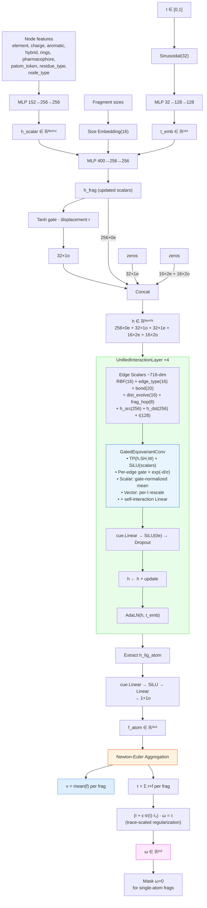

# Model Architecture

## Overview

FlowFrag is a unified SE(3)-equivariant GNN over a heterogeneous protein-ligand graph. The model predicts per-atom forces on ligand atoms, which are then aggregated via Newton-Euler mechanics into per-fragment translation velocity **v** and angular velocity **ω** for flow matching-based docking.

## Architecture Diagram



## Node Types

| ID | Type | Description |
|----|------|-------------|
| 0 | `ligand_atom` | Ligand heavy atoms |
| 1 | `ligand_fragment` | Fragment center virtual nodes |
| 2 | `protein_atom` | Pocket heavy atoms |
| 3 | `protein_res` | Residue virtual nodes (CB / pseudo-CB / metal) |

## Edge Types

| ID | Type | Description |
|----|------|-------------|
| 0 | `ligand_bond` | Covalent ligand bonds (with chemistry features) |
| 1 | `ligand_tri` | Cross-fragment distance constraints (triangulation) |
| 2 | `ligand_cut` | Cut bonds (inter-fragment boundaries) |
| 3 | `ligand_atom_frag` | Atom ↔ parent fragment |
| 4 | `ligand_frag_frag` | All-pairs between fragment nodes (with hop distance) |
| 5 | `protein_bond` | Canonical protein bonds (intra-AA + peptide + disulfide) |
| 6 | `protein_atom_res` | Protein atom ↔ parent residue |
| 7 | `protein_res_res` | Residue ↔ residue (10 Å cutoff) |
| 8 | `protein_res_frag` | Residue ↔ fragment (all-pairs bipartite) |
| 9 | `dynamic_contact` | Runtime protein-ligand atom contacts (rebuilt per forward) |

## Irreps Layout

All nodes share a single irreps space:

```
h = [256×0e] + [32×1o] + [32×1e] + [16×2e] + [16×2o]      = 608 dim
     scalar     vec       pseudo-v  rank-2    rank-2-odd
```

- **0e (scalars)**: chemistry, embeddings, time conditioning
- **1o (true vectors)**: displacement-gated directions, atom forces
- **1e (pseudo-vectors)**: potential angular velocity / cross-product signals
- **2e / 2o (rank-2 tensors)**: higher-order geometric features (5 components each)

## GatedEquivariantConv

Core graph convolution. Uses cuEquivariance's `FullyConnectedTensorProduct` CUDA kernel but wraps it with our own gating and aggregation.

```
1. msg     = TP(h[src], SH(edge_vec), weight_MLP(edge_scalars))
2. msg[scalar] ← SiLU(msg[scalar])                          # post-TP activation
3. gate    = σ(gate_MLP(edge_scalars)) × exp(-dist/σ_decay) # distance-decayed attention
4. out[scalar] = Σ(gate · msg[scalar]) / (Σ gate + ε)        # gate-normalized mean
5. out[vec]    = gate-normalized sum, then:
     per-l-group: direction/magnitude split → SiLU(Linear(norm)) rescale
6. self_update = cue.Linear(h)                               # self-interaction (no TP)
7. return out + self_update
```

### Key design choices

1. **Distance decay** with learnable σ: far-away edges naturally attenuated.
2. **Gate-normalized aggregation**: degree-invariant (# of neighbors doesn't change scale).
3. **Per-l-group rescaling**: l=1 and l=2 channels have separate `Linear → SiLU` since their norm magnitudes differ.
4. **Self-interaction = cue.Linear**: cheaper than a second TP, mathematically equivalent to `TP(h, 1x0e)`.
5. **Post-TP scalar activation**: adds non-linearity since TP output is bilinear in inputs.

## Newton-Euler Head

Fragment velocities are derived from per-atom forces via rigid-body mechanics:

```
v_frag    = mean(f_atom) per fragment                (translation)
τ_frag    = Σ (r_atom_arm × f_atom) per fragment     (torque)
I_frag    = Σ (|r|² I₃ − r⊗r) per fragment + ε·I₃    (inertia, trace-scaled ε)
ω_frag    = I_frag⁻¹ · τ_frag                         (angular velocity)
```

**Trace-scaled regularization**: `ε = max(1e-4, 1e-2 · trace(I)/3)` handles both single-atom (exactly singular) and collinear/compact (nearly singular) fragments safely.

Single-atom fragments get ω = 0 (no meaningful rotation).

## Edge Features

| Feature | Dim | Description |
|---------|-----|-------------|
| RBF(dist) | 16 | Radial basis encoding of edge distance |
| edge_type_emb | 16 | Edge category (9 static + 1 dynamic) |
| bond features | 20 | bond_type + conjugated + in_ring + stereo (sentinel for non-bond edges) |
| dist_evolve | 16 | `(d_t, d_t - d_ref, log(d_t/d_ref), has_ref)` → learned projection |
| frag_hop | 8 | Topological hop distance between fragments |
| h_src, h_dst | 256+256 | Source and destination node scalars (src+dst-aware attention) |
| t_emb | 128 | Time conditioning |

Total: ~716 dim → weight MLP → TP external weights.

## Flow Matching Setup

- **Prior** (t=0): `T_0 ~ N(pocket_center, σ² I)`, `q_0 ~ Uniform(SO(3))` per fragment (independent)
- **Target** (t=1): crystal fragment centers + identity rotation (or sampled rotation under augmentation)
- **Interpolation**: linear for translation, SLERP for rotation
- **Velocity targets**:
  - `v_target = T_1 − T_0`
  - `ω_target` from SLERP derivative (body-frame or world-frame)

Default `prior_sigma = 5.0 Å` covers ~95% of the target centroid distribution (measured from PDBbind 2020).

## Loss

```
L = ‖v_pred − v_target‖² + w_ω · ‖ω_pred − ω_target‖²
```

Default `omega_weight = 18` balances MSE gradients (empirically: ‖v‖² / ‖ω‖² ≈ 18 at σ=5).

## Implementation

| Component | Location |
|-----------|----------|
| Model | `src/models/unified.py` |
| Equivariant layers | `src/models/equivariant.py` |
| Utility layers | `src/models/layers.py` |
| Graph construction | `src/preprocess/graph.py` |
| Pocket crop | `src/data/dataset.py:crop_to_pocket` |
| Flow matching | `src/geometry/flow_matching.py` |
| SE(3) ops | `src/geometry/se3.py` |
| Training loop | `src/training/trainer.py` |

## Inference

At inference time, the pipeline mirrors training:

1. Parse full protein (`parse_pocket_atoms` without cutoff)
2. Provide a pocket center (user-specified or derived from a reference ligand)
3. Crop protein around the pocket center
4. Sample prior: `T_0 ~ N(0, σ²)`, `q_0 ~ Uniform(SO(3))` independently per fragment
5. Integrate ODE from t=0 to t=1 using the trained velocity field
6. Sample multiple times (`--num_samples`) for pose diversity; no special multi-conformer handling needed — the independent random prior covers pose space

Entry point: `scripts/dock.py`.
