# FlowFrag Model Architecture

## Overview

FlowFrag uses a unified SE(3)-equivariant GNN over a heterogeneous graph
containing protein and ligand nodes. The model predicts per-fragment
translation velocity `v` and angular velocity `ω` for flow matching-based
docking.

## Architecture Diagram

```mermaid
flowchart TB
    %% ── Inputs ──
    IN_t["t ∈ [0,1]"] --> SIN["Sinusoidal(32)"]
    SIN --> TMLP["MLP 32→128→128"]
    TMLP --> t_emb["t_emb"]

    IN_node["Node features\nelement, charge, aromatic,\nhybrid, ring, node_type,\namino_acid, pharmacophore"] --> NEMB["MLP 120→256→256"]
    NEMB --> h0["h_scalar ∈ ℝ^(N×256)"]

    IN_frag["Fragment sizes"] --> SEMB["Size Embedding(16)"]
    h0 --> FINIT
    SEMB --> FINIT
    t_emb --> FINIT["MLP 400→256→256"]
    FINIT --> h0_frag["h_frag (updated scalars)"]

    %% ── Equivariant State ──
    h0_frag --> GATE["Tanh gate · displacement r"]
    GATE --> h1o["32×1o"]

    IN_R["R_t (rotation)"] --> RGATE["Tanh gate · R_t columns"]
    h0_frag --> RGATE
    RGATE --> h1o

    h1o --> CONCAT
    h0_frag -->|"256×0e"| CONCAT
    ZERO1["zeros"] -->|"32×1e"| CONCAT
    ZERO2["zeros"] -->|"16×2e"| CONCAT
    CONCAT["Concat"] --> h["h ∈ ℝ^(N×608)\n256×0e + 32×1o + 32×1e + 16×2e + 16×2o"]

    %% ── Layer 1 ──
    h --> L1

    subgraph L1["Layer 1"]
        direction TB
        E1["Edge Scalars (700-dim)\nRBF(16) ⊕ edge_type(16) ⊕ bond(20)\n⊕ ref_dist(8) ⊕ h_src(256) ⊕ h_dst(256) ⊕ t(128)"]
        T1["TP Conv (cuEquivariance)\nSH l=0,1,2 × node_irreps → node_irreps"]
        P1["Linear → SiLU(0e) → Dropout"]
        R1["h ← h + update"]
        A1["AdaLN(h, t_emb)"]
        E1 --> T1 --> P1 --> R1 --> A1
    end

    L1 --> RI1["R_t re-injection → frag 1o"]
    RI1 --> L2

    subgraph L2["Layer 2"]
        direction TB
        E2["Edge Scalars"] --> T2["TP Conv"] --> P2["Linear → SiLU → Drop"] --> R2["Residual"] --> A2["AdaLN"]
    end

    L2 --> RI2["R_t re-injection → frag 1o"]
    RI2 --> L3

    subgraph L3["Layer 3"]
        direction TB
        E3["Edge Scalars"] --> T3["TP Conv"] --> P3["Linear → SiLU → Drop"] --> R3["Residual"] --> A3["AdaLN"]
    end

    L3 --> RI3["R_t re-injection → frag 1o"]
    RI3 --> L4

    subgraph L4["Layer 4"]
        direction TB
        E4["Edge Scalars"] --> T4["TP Conv"] --> P4["Linear → SiLU → Drop"] --> R4["Residual"] --> A4["AdaLN"]
    end

    %% ── Output ──
    L4 --> EXTRACT["Extract h_frag\n(fragment nodes only)"]

    EXTRACT --> VHEAD["Linear → SiLU → Linear\n→ 1×1o"]
    EXTRACT --> WHEAD["Linear → SiLU → Linear\n→ 1×1e"]

    VHEAD --> v["v_pred ∈ ℝ^(F×3)\ntranslation velocity"]
    WHEAD --> w["ω_pred ∈ ℝ^(F×3)\nangular velocity"]
    w --> WMASK["Mask ω=0\nfor single-atom frags"]

    %% ── Styles ──
    style L1 fill:#e8fde8,stroke:#4ad94a
    style L2 fill:#e8fde8,stroke:#4ad94a
    style L3 fill:#e8fde8,stroke:#4ad94a
    style L4 fill:#e8fde8,stroke:#4ad94a
    style v fill:#ddeeff,stroke:#4a90d9
    style w fill:#fde8fd,stroke:#d94ad9
    style WMASK fill:#fde8fd,stroke:#d94ad9
```



## Node Types

| ID | Type | Description | Count (example) |
|----|------|-------------|-----------------|
| 0 | `ligand_atom` | Ligand heavy atoms | 27 |
| 1 | `ligand_dummy` | Dummy atoms at cut bonds (optional) | 0 |
| 2 | `ligand_fragment` | Fragment center nodes | 6 |
| 3 | `protein_atom` | Pocket heavy atoms (8Å cutoff) | 485 |
| 4 | `protein_ca` | Cα virtual nodes per residue | 56 |

## Edge Types

| ID | Type | Description | Count (example) |
|----|------|-------------|-----------------|
| 0 | `ligand_bond` | Covalent bonds in ligand | 29 |
| 1 | `ligand_tri` | Triangulation (cross-fragment distance constraints) | 13 |
| 2 | `ligand_cut` | Cut bonds (inter-fragment) | 5 |
| 3 | `ligand_atom_frag` | Atom ↔ parent fragment | 27 |
| 4 | `ligand_frag_frag` | Adjacent fragment pairs | 15 |
| 5 | `protein_bond` | Protein covalent bonds | 485 |
| 6 | `protein_atom_ca` | Protein atom ↔ parent Cα | 485 |
| 7 | `protein_ca_ca` | Cα ↔ Cα (distance-based) | 1117 |
| 8 | `protein_ca_frag` | Cα ↔ nearby fragment | 336 |
| 9 | `dynamic_contact` | Runtime protein-ligand contacts (optional) | varies |

## Irreps Layout

All nodes share the same irreps space:

```
h = [256×0e] + [32×1o] + [32×1e] + [16×2e] + [16×2o]
     scalar     vector    pseudo-v   quadrupole  pseudo-q
     (256)      (96)      (96)       (80)        (80)
                                                 = 608 total
```

- **0e (scalars)**: Chemical features, embeddings
- **1o (odd vectors)**: Displacement-gated directions, forces
- **1e (even pseudo-vectors)**: Angular velocity output channel
- **2e (quadrupoles)**: Higher-order geometric features
- **2o (pseudo-quadrupoles)**: Parity-odd rank-2 features

## Key Design Choices

1. **Single TP conv for all edge types**: Edge-type specialization via
   edge scalar features (type embedding + bond features), not separate
   convolution layers per type.

2. **R_t injection per layer**: Fragment rotation matrix columns are
   gated and added to fragment 1o channels at every layer, not just
   initialization. This provides continuous rotation state awareness.

3. **Newton-Euler mode**: Optional atom-level force prediction with
   physical aggregation (torque → inertia solve → ω). Alternative to
   direct fragment-level ω prediction.

4. **AdaLN time conditioning**: Adaptive layer normalization modulates
   node features based on the flow matching time step, allowing the
   model to behave differently at early (coarse) vs late (fine) stages.

5. **cuEquivariance acceleration**: All tensor products use NVIDIA's
   cuEquivariance CUDA kernels with `mul_ir` layout for performance.

## Implementation

- Model: `src/models/unified.py::UnifiedFlowFrag`
- Equivariant layers: `src/models/equivariant.py`
- Utility layers: `src/models/layers.py`
- Graph construction: `src/preprocess/graph.py`
