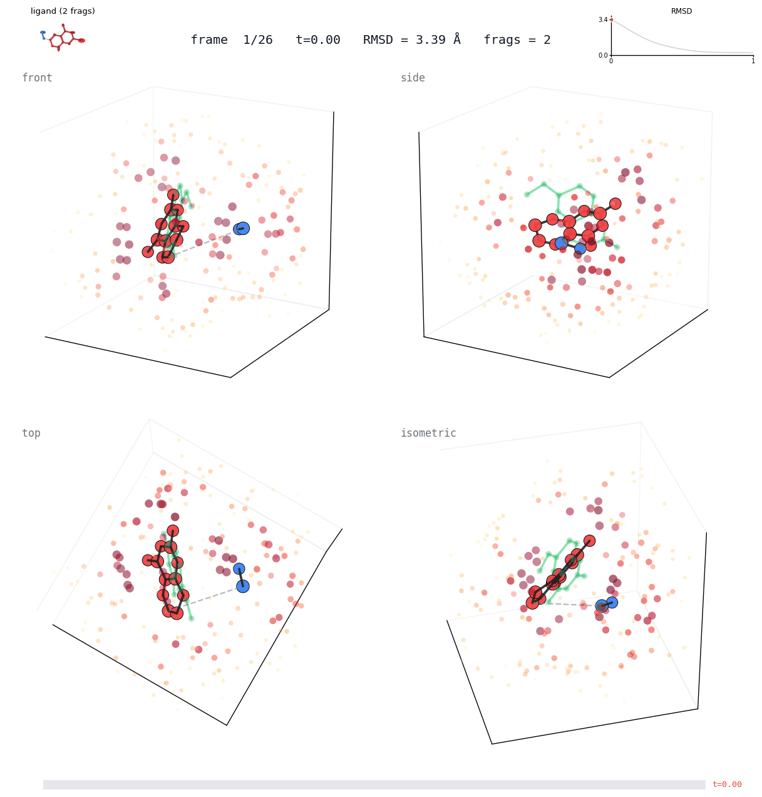
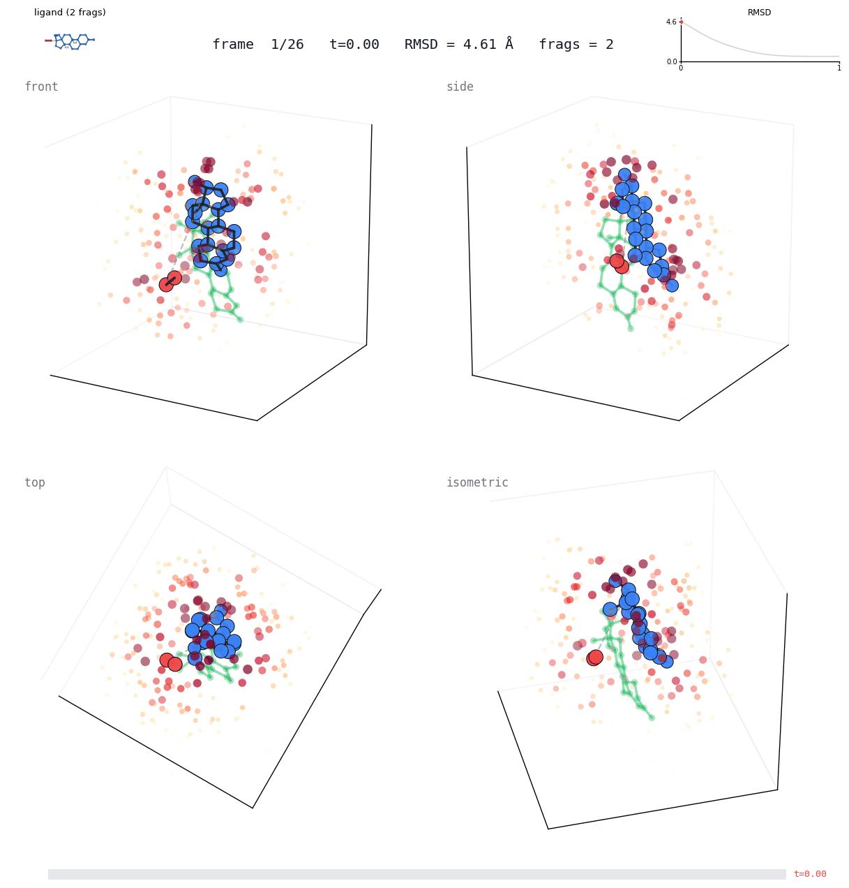
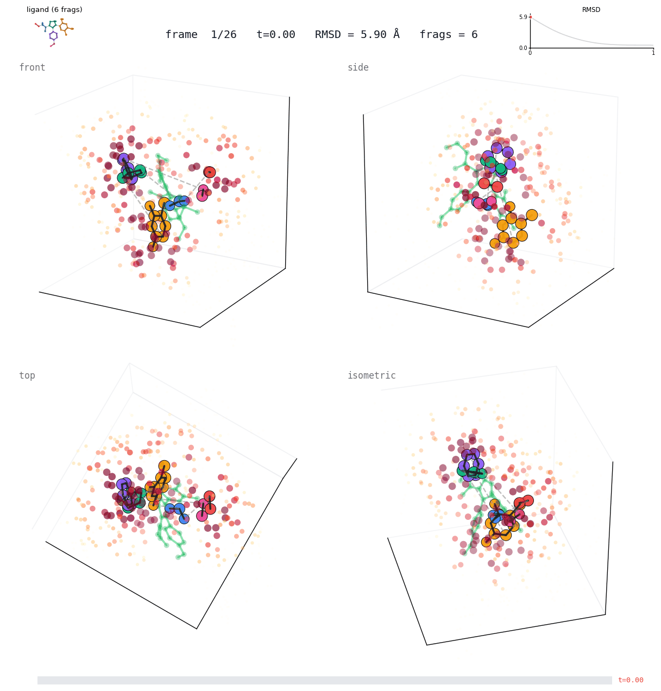
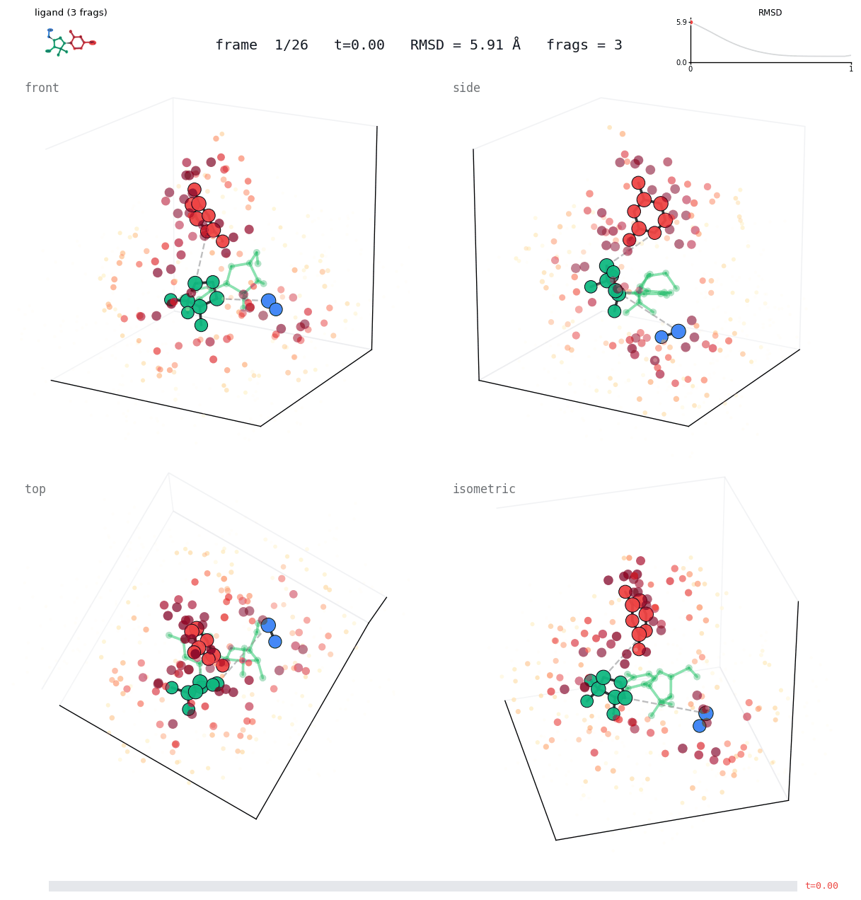
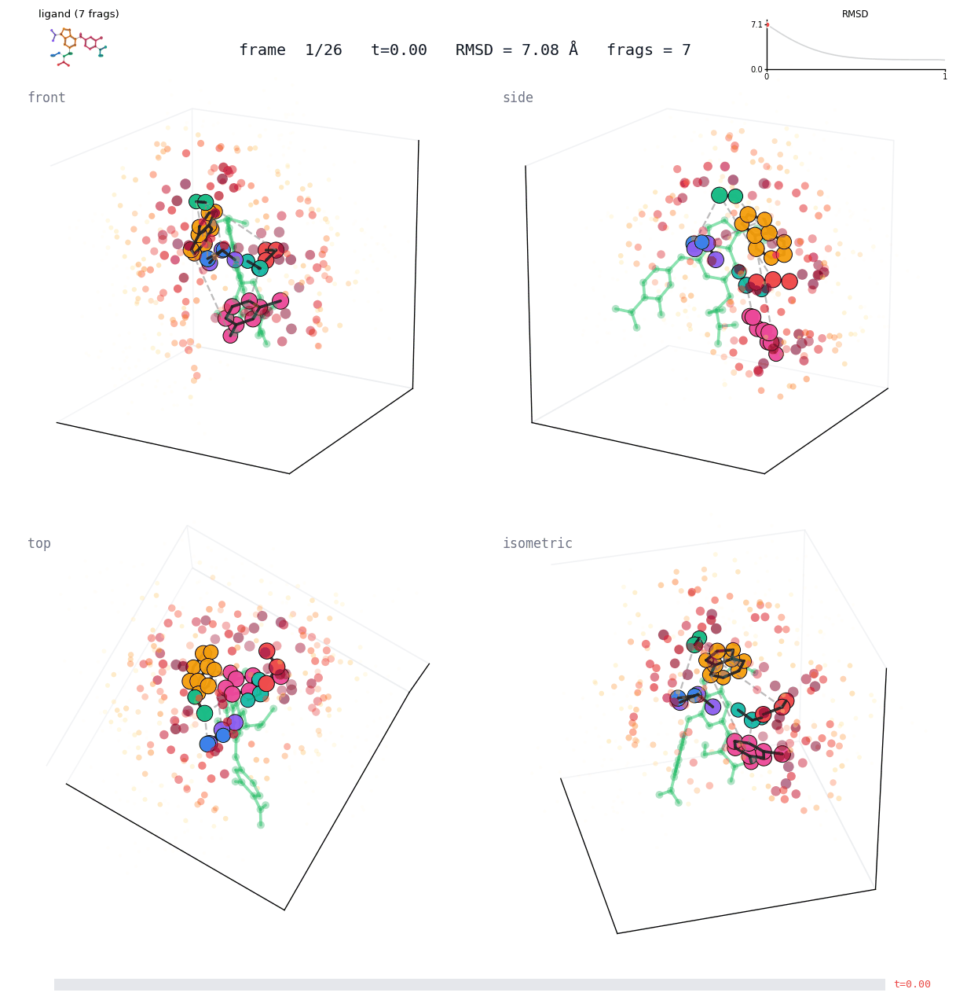
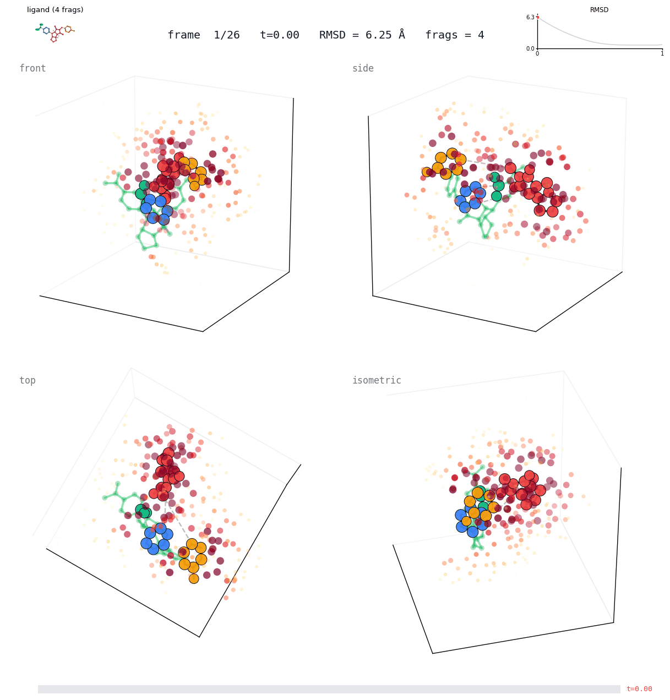

# Benchmark Evaluation

## Setup

- **Input**: **SMILES only** — 3D starting conformers are re-embedded per complex via RDKit ETKDGv3 + MMFF94s. Crystal ligand coordinates are used only for the pocket-center reference and as the RMSD ground truth.
- **SMILES source**: RCSB Chemical Component Dictionary fetched per-PDB by `scripts/fetch_astex_smiles.py` and `scripts/fetch_pb_smiles.py`; cached in `data/astex_smiles.json` and `data/pb_smiles.json`.
- **ODE**: 10 steps, late schedule (power = 3.0).
- **Prior**: translation &sigma; = 3.0 &Aring; centered at pocket, rotation uniform on SO(3).
- **Pocket center**: centroid of protein residue virtual nodes within 8 &Aring; of the crystal ligand (matches the training definition). Derived from the full `{id}_protein.pdb` — a few Astex pocket files ship truncated (e.g. 1q1g with 21 heavy atoms, 1u1c empty) and would otherwise place the pocket center &ge;9 &Aring; off the true site.
- **Sampling**: N = 40 poses per complex, generated in a single batched ODE integration (graph replicated N times, one model forward per ODE step instead of one per sample — &sim;4x over the sequential sampler).
- **Refinement**: vacuum MMFF94s with position restraints (constraint strength 50, tolerance 0.5 &Aring;) so the pose is only locally relaxed, not dragged back to the gas-phase minimum.
- **RMSD**: heavy-atom, **symmetry-aware** via RDKit `rdMolAlign.CalcRMS` (no alignment). For complexes where the SMILES-derived topology differs from the crystal (partial build, alternate tautomer), atoms are matched by MCS and RMSD is computed on the matched subset.

### Optional: Vina-gradient physics guidance

At each ODE step the sampler can mix a physics drift into the learned drift:

$$v_{\text{final}} = v_{\text{pred}} + \lambda(t) \cdot v_{\text{phys}}, \qquad \omega_{\text{final}} = \omega_{\text{pred}} + \lambda(t) \cdot \omega_{\text{phys}}$$

where $(v_{\text{phys}}, \omega_{\text{phys}})$ are produced by back-propagating the AutoDock Vina intermolecular energy into per-atom forces and then through the same Newton-Euler rigid-body aggregation the model uses. The schedule $\lambda(t) = \lambda_{\max} \cdot t^{p}$ is zero for $t < t_{\text{start}}$, so guidance only acts once the flow has mostly converged.

Default preset used for the reported numbers below: $\lambda_{\max} = 3.0$, $p = 2.0$, $t_{\text{start}} = 0.3$, per-atom force clipped to 10 kcal/(mol&middot;&Aring;). Enabled per-run via `--phys_guidance`. Tuned from a 10-complex &times; 5-&lambda; sweep (`scripts/phys_lambda_sweep.py`) that swept $\lambda \in \{0, 1, 2, 3, 5\}$ with paired priors: aggregate oracle RMSD monotonically improved through $\lambda = 3$ and plateaued/reversed at $\lambda = 5$.

## Evaluation Regime

FlowFrag performs **pocket-conditioned re-docking**: the binding site is known and the model predicts the ligand pose within it. Comparable to Uni-Mol, AutoDock Vina re-dock, SigmaDock. **Not** directly comparable to blind docking (DiffDock, FlowSite).

Because the input is SMILES-only (starting 3D conformer is re-embedded from scratch), the atom ordering of the docked mol generally differs from the crystal; matching is done per complex before RMSD is computed.

## Datasets

| Dataset | Complexes evaluated | Ligand source (crystal) | Protein source |
|---|---|---|---|
| Astex Diverse | 85 / 85 | MOL2 | Full-protein PDB |
| PoseBusters v2 | 308 / 308 | SDF | Full-protein PDB |

## Pose Selection

| Strategy | Description | Requires ground truth? |
|---|---|---|
| Oracle | argmin RMSD to crystal over N samples | Yes (upper bound) |
| Vina | Top-1 by combined score `s = -E_vina &middot; p^&beta;`, &beta; = 4 | No |

`E_vina` is the AutoDock Vina energy computed on the predicted pose, `p` is the PoseBusters-style physicochemical validity score. See [scoring.md](scoring.md).

## Results

### Astex Diverse (N = 40, SMILES input)

**Baseline — learned drift only**

| Refinement | Selection | Mean | Median | &lt;1&Aring; | &lt;2&Aring; | &lt;5&Aring; |
|---|---|---|---|---|---|---|
| None | Oracle | 0.91 | 0.78 | 69.4% | 96.5% | 100.0% |
| None | Vina | 1.97 | 1.36 | 34.1% | 63.5% | 94.1% |
| MMFF | Oracle | 0.91 | 0.78 | 70.6% | 95.3% | 100.0% |
| MMFF | Vina | 1.82 | 1.24 | 35.3% | 69.4% | 95.3% |

**With Vina-gradient guidance** (&lambda;<sub>max</sub> = 3.0, t<sub>start</sub> = 0.3, power = 2.0)

| Refinement | Selection | Mean | Median | &lt;1&Aring; | &lt;2&Aring; | &lt;5&Aring; |
|---|---|---|---|---|---|---|
| None | Oracle | **0.86** | 0.77 | 71.8% | 95.3% | 100.0% |
| None | Vina | **1.80** | 1.35 | 31.8% | **70.6%** | **97.6%** |
| MMFF | Oracle | 0.87 | **0.71** | 72.9% | 94.1% | 100.0% |
| MMFF | Vina | **1.79** | **1.30** | **38.8%** | **72.9%** | 94.1% |

### PoseBusters v2 (N = 40, SMILES input)

_Pending — full 308-complex rerun with batched sampler + &lambda; = 3 guidance in progress._

## Key Observations

1. **Oracle ceiling is very high on Astex.** Mean 0.91 &Aring;, median 0.78 &Aring;, and 100 % of complexes within 5 &Aring;. Of the 85 complexes, 96.5 % produce a &lt;2 &Aring; pose within 40 samples. The remaining work is in the selection step.

2. **Physics guidance helps Vina-selected poses the most.** With &lambda; = 3 the `None + Vina` combo gains +7.1 %p at &lt;2 &Aring; (63.5% &rarr; 70.6%) and +3.5 %p at &lt;5 &Aring;; `MMFF + Vina` gains +3.5 %p at &lt;2 &Aring; (69.4% &rarr; 72.9%) and +3.5 %p at &lt;1 &Aring;. The Vina gradient biases the ODE drift toward local energy minima, so Vina-based selection picks them more often.

3. **MMFF refinement is near-neutral** (&plusmn;0.05 &Aring; on the mean) once position restraints prevent it from dragging the ligand toward the gas-phase minimum. It helps the median slightly under guidance (0.78 &rarr; 0.71 &Aring; on Oracle).

4. **Selection gap (Oracle &rarr; Vina)** remains &sim;24 %p on `&lt;2 &Aring;` even with guidance. A trained pose-confidence model should close most of this; physics guidance alone only narrows the gap by a few percent.

5. **Fix notes.** Two Astex pocket files (1q1g, 1u1c) ship with &lt;10 % of the binding-site residues, which placed `pocket_center` 9+ &Aring; off the true site and either failed outright or produced 5&ndash;11 &Aring; poses. Using `{id}_protein.pdb` for pocket-center derivation reinstates them and moves the Astex denominator from 84 to 85.

## Visualization

Per-sample ODE trajectories can be rendered with `scripts/viz_traj.py`:

```bash
uv run python scripts/dock.py \
    --protein /path/to/pocket.pdb --ligand "<SMILES>" \
    --pocket_center x,y,z \
    --checkpoint weights/best.pt --config configs/train_v3_b200.yaml \
    --num_samples 1 --num_steps 25 --save_traj --out_dir outputs/traj_<id>

uv run python scripts/viz_traj.py \
    --traj outputs/traj_<id>/traj_0.sdf \
    --protein /path/to/pocket.pdb \
    --crystal_ligand /path/to/crystal_ligand.{sdf,mol2} \
    --out_dir outputs/viz_<id>
```

The renderer shows:
- **Main 3D view**: predicted ligand as ball-and-stick (atoms colored per fragment), crystal ligand as translucent green ghost, protein heavy atoms as a "contact heatmap" (red glow for atoms &lt; 2.5 &Aring; of the ligand, fading to faint grey past 7 &Aring; — pocket residues "blink" as the ligand arrives).
- **Fragment centroid trails**: each fragment leaves a colored tail as it translates; rigid-body flow becomes visible per fragment.
- **2D ligand sketch (top-left)**: RDKit depiction of the molecular graph with identical fragment coloring, so you can map rings in the 3D view to atoms in the chemical structure.
- **RMSD inset (top-right)**: full curve in grey, progress up to the current frame in red.
- **Flow time bar (bottom)**: t = 0 → 1 filled proportionally.

### Gallery

Oracle-best trajectory (best of 10 samples by RMSD) per complex, 25 ODE steps, SMILES-only input. RMSD is heavy-atom vs crystal with symmetry-aware matching.

#### Astex Diverse

| Complex | Atoms / Fragments | Oracle RMSD | Trajectory |
|---|---|---|---|
| `1hq2` (rigid purine) | 14 / 2 | **0.39 &Aring;** |  |
| `1sqn` (steroid) | 22 / 2 | **0.50 &Aring;** |  |
| `2bsm` (inhibitor) | 27 / 6 | **0.54 &Aring;** |  |
| `1gkc` (peptidomimetic) | 22 / 6 | **0.70 &Aring;** |  |
| `1p62` (bifunctional) | 18 / 3 | **0.73 &Aring;** |  |
| `1v0p` (flexible) | 30 / 7 | **0.87 &Aring;** |  |
| `1oyt` (mid-size) | 30 / 4 | **0.92 &Aring;** |  |

#### PoseBusters v2

| Complex | Atoms / Fragments | Oracle RMSD | Trajectory |
|---|---|---|---|
| `7WJB_BGC` (sugar) | 12 / 2 | **0.46 &Aring;** |  |
| `7UAW_MF6` (lipid) | 35 / 2 | **0.67 &Aring;** |  |
| `8D39_QDB` (mid-size) | 17 / 4 | **1.02 &Aring;** |  |
| `7NP6_UK8` (flexible) | 32 / 7 | **1.16 &Aring;** |  |
| `7N6F_0I1` (multi-ring) | 26 / 4 | **1.27 &Aring;** |  |
| `7KM8_WPD` (very flexible) | 29 / 8 | **2.42 &Aring;** |  |

These are hand-picked to span easy → hard (fragment count 2 → 8). All still land within 5 &Aring; of the crystal pose even at 8 fragments.

## Caveats

- These are **pocket-conditioned** results. Compare only against other pocket-conditioned methods, not blind docking.
- **Pocket center leaks crystal-ligand position** (residues within 8 &Aring; of the crystal). This matches training but is an oracle-level assumption. For a harder, realistic setting, use apo-structure + fpocket / P2Rank center.
- **Oracle** is an upper bound assuming a perfect confidence model. **Vina** is the realistic deployable number.
- Physics guidance adds one extra Vina backward pass per ODE step. With the batched sampler the total wall-clock overhead is &sim;7 % vs baseline (Astex 859 s &rarr; 919 s for 85 complexes).

## References

- AutoDock Vina: Trott & Olson, *J. Comput. Chem.* 31(2):455–461, 2010.
- PoseBusters: Buttenschoen, Morris & Deane, *Chem. Sci.* 15:3130–3139, 2024.
- SigmaDock: Prat et al., arXiv:2511.04854, 2025.
